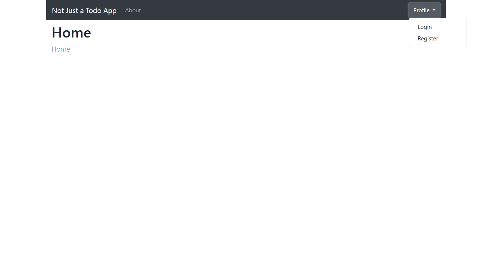
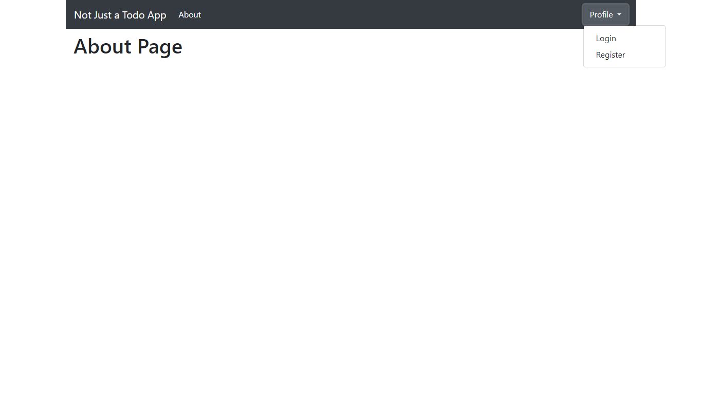
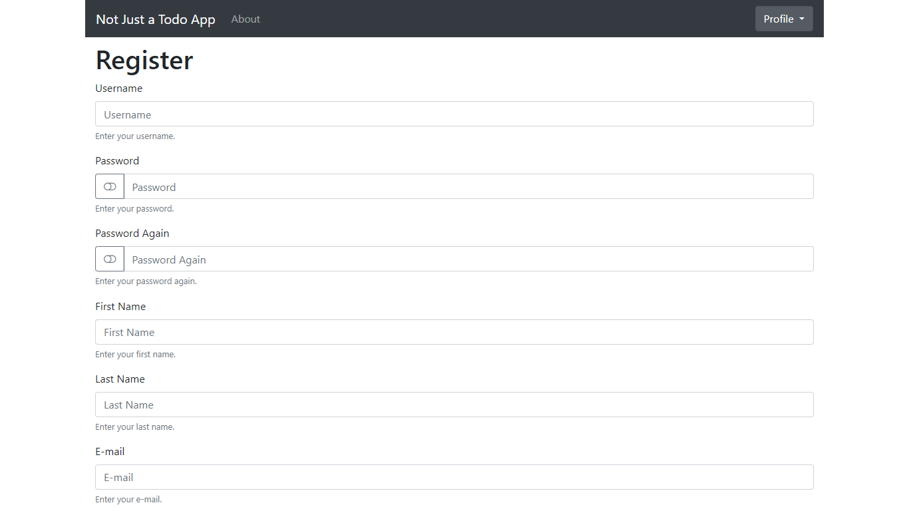
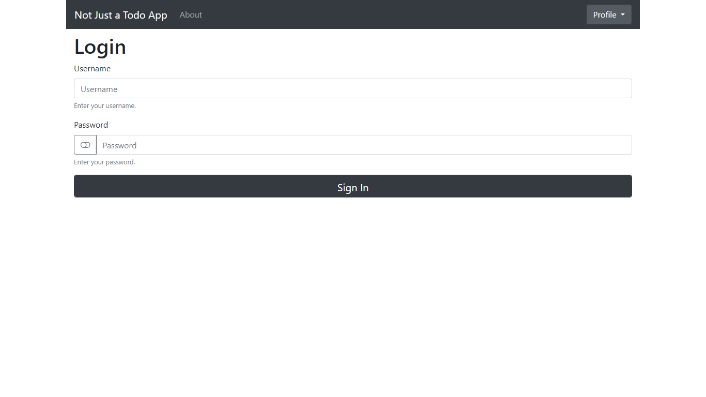
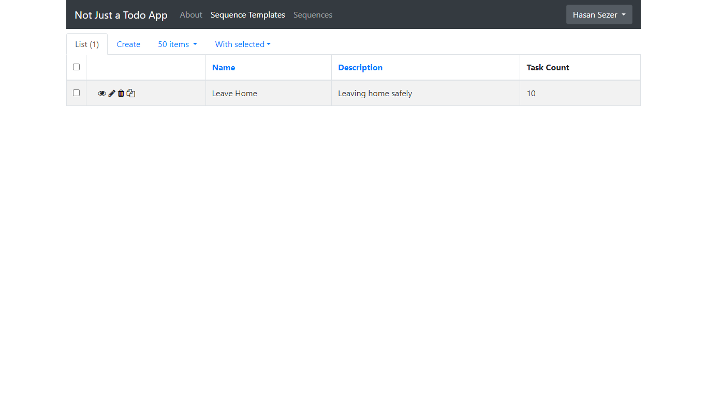
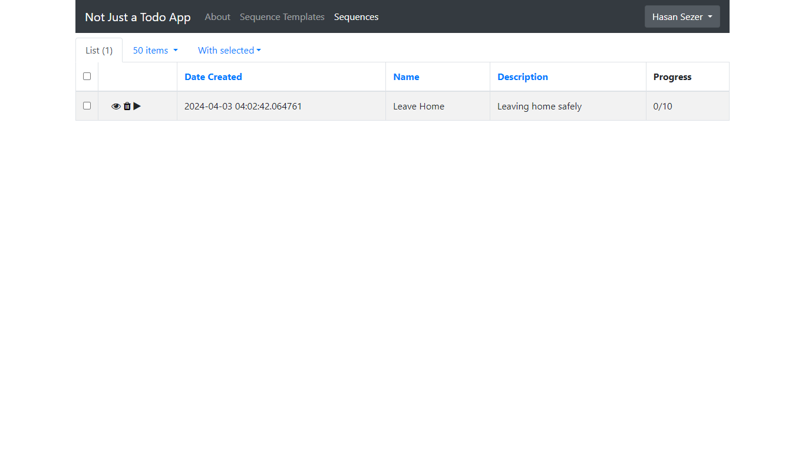
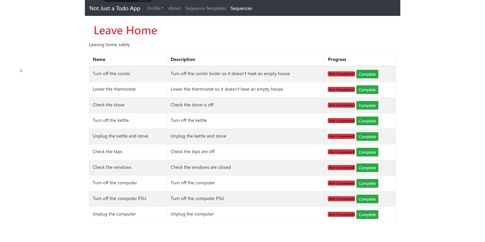

# Not Just a Todo App

> Experimental - Every dev needs to build a todo app...

[](https://www.djlint.com)

## Table of Contents

- [Not Just a Todo App](#not-just-a-todo-app)
  - [Table of Contents](#table-of-contents)
  - [Screenshots](#screenshots)
    - [Home Page](#home-page)
    - [About Page](#about-page)
    - [Register Page](#register-page)
    - [Login Page](#login-page)
    - [Sequence Template List View](#sequence-template-list-view)
    - [Sequence List View](#sequence-list-view)
    - [Sequence Progress Page](#sequence-progress-page)
  - [Features](#features)
  - [How to Run](#how-to-run)
    - [Prerequisites](#prerequisites)
    - [Setup](#setup)
    - [Database](#database)
    - [Run](#run)
  - [About](#about)
  - [License](#license)

## Screenshots

### Home Page



### About Page



### Register Page



### Login Page



### Sequence Template List View



### Sequence List View



### Sequence Progress Page



## Features

**Application:**

- Create Task Sequences as Templates
- Instantiate Task Sequences
- Complete tasks in Task Sequences
- Login and Register
- Change Password

**Production hardening:**

- Application factory (`create_app()`), instance-relative config, lazy extension init
- Argon2 password hashing (bcrypt verified for legacy rows)
- CSRF protection, secure-cookie defaults, ProxyFix, strong session protection
- Rate-limiting (Flask-Limiter) + per-account lockout after N failed logins
- `/healthz` + `/livez` (liveness) and `/readyz` (readiness, checks DB) — all `Cache-Control: no-store`, accept HEAD
- `/metrics` (Prometheus) — request count, latency histograms
- Structured JSON logging (request_id auto-bound) with `LOG_FORMAT=text` fallback for local dev
- Sentry + OpenTelemetry integration (env-gated)
- Gzip/brotli response compression (Flask-Compress) + content-hashed static URLs (Flask-Static-Digest)
- Multi-stage Dockerfile (Bun → uv → slim runtime), non-root user, OCI labels, `HEALTHCHECK`

## How to Run

### Prerequisites

- [`mise`](https://mise.jdx.dev/) (recommended) — manages Python, `uv`, and `bun` versions
- Or install manually: Python 3.x, [`uv`](https://docs.astral.sh/uv/), [`bun`](https://bun.sh/)

### Setup

`mise install` only installs the tool versions in `mise.toml` (uv, bun,
ruff, prek). Project deps are installed separately:

```bash
mise install                              # tools (uv, bun, ruff, prek)
uv sync --all-groups --all-extras         # Python deps
bun install && ./tools/copy-vendor-assets.sh     # frontend deps + vendor copy
```

### Database

Apply migrations:

```bash
uv run flask db upgrade
```

Optional — seed test data:

```bash
uv run flask seed users
uv run flask seed sequences
```

### Run

```bash
uv run flask run
```

App entry point: `src/app/wsgi.py` (auto-discovered by Flask). Open <http://127.0.0.1:5000>.

### Docker

```bash
docker compose up --build
```

Image runs `gunicorn` on port 8000 with the config at `gunicorn.conf.py`.
Healthcheck probes `/readyz`. Persistent state (SQLite DB) lives in the
`app-instance` volume mounted at `/app/instance`.

### Architecture

```
src/app/
  factory.py    # create_app() — wires extensions, middleware, CLI
  wsgi.py       # gunicorn entrypoint — `app = create_app()`
  config.py     # Pydantic Settings (loads .env, validates)
  extensions.py # module-level singletons (db, login_manager, ...)
  middleware.py # request-id, security headers, error handlers
  admin.py      # Flask-Admin instance + add_view registrations
  views/        # Flask-Admin view classes (no @app.route)
  services/    # Domain operations — HTTP-free, unit-testable
  db/
    models/     # SQLAlchemy 2 models
    migrations/ # Alembic / Flask-Migrate
    fixtures/   # Seed data (JSON)
```

See `.env.example` for the full set of supported environment variables.

## About

> Birthday of the idea: 16 February 2023 Thursday - 19:00 (It's all clear now...)

It's been a long time since I planned to make this app. I also wanted to try something different. Likewise, I haven't been developing an application with Flask for a while and I wanted to refresh my Flask knowledge.

I decided to develop an admin-interface-driven application with Flask, Flask Login and Flask Admin, Flask SQLAlchemy, Flask WTF and Bootstrap Flask.

> What is admin-interface-driven? It's a term I just made up. It means that the entire application is managed through the admin interface, there are no hand-written routes. All pages are delivered as Flask Admin views.

In summary, it's an attempt to use Flask Admin as a user interface instead of just using it as an administrative interface or admin only interface.

> Before I forget, I didn't write a single line of JavaScript, thanks to HTMX...

## License

This project is licensed under the terms of the [MIT](https://spdx.org/licenses/MIT.html) license.
