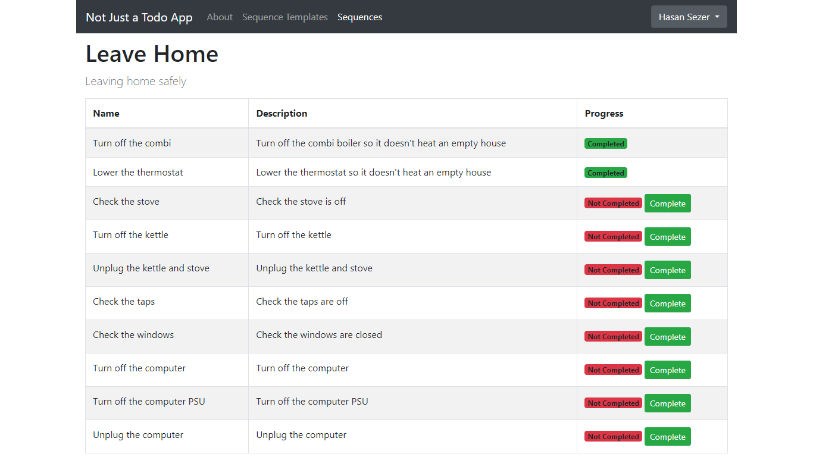

# Not Just a Todo App

> Experimental - Every dev needs to build a todo app...

## Table of Contents

- [Not Just a Todo App](#not-just-a-todo-app)
  - [Table of Contents](#table-of-contents)
  - [Screenshots](#screenshots)
    - [Register Page](#register-page)
    - [Login Page](#login-page)
    - [Sequence List View](#sequence-list-view)
    - [Sequence Progress Page](#sequence-progress-page)
  - [Features](#features)
  - [About](#about)
  - [License](#license)

## Screenshots

### Register Page

### Login Page

### Sequence List View

### Sequence Progress Page

## Features

- Create Task Sequences as Templates
- Instantiate Task Sequences
- Complete tasks in Task Sequences

## About

> Birthday of the idea: 16 February 2023 Thursday - 19:00 (It's all clear now...)

It's been a long time since I planned to make this app. I also wanted to try something different. Likewise, I haven't been developing an application with Flask for a while and I wanted to refresh my Flask knowledge.

I decided to develop an admin-interface-driven application with Flask, Flask Login and Flask Admin, Flask SQLAlchemy, Flask WTF and Bootstrap Flask. What I mean by admin-interface-driven is this: I haven't written a route with Flask, all pages delivered as Flask Admin views.

In summary, it's an attempt to use Flask Admin as a user interface instead of just using it as an administrative interface or admin only interface.

> Before I forget, I didn't write a single line of JavaScript, thanks to HTMX...

## License

This project is licensed under the terms of the [MIT](https://spdx.org/licenses/MIT.html) license.
